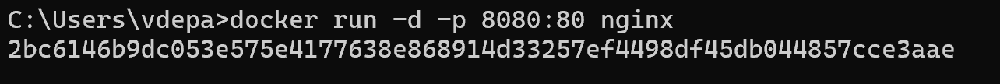
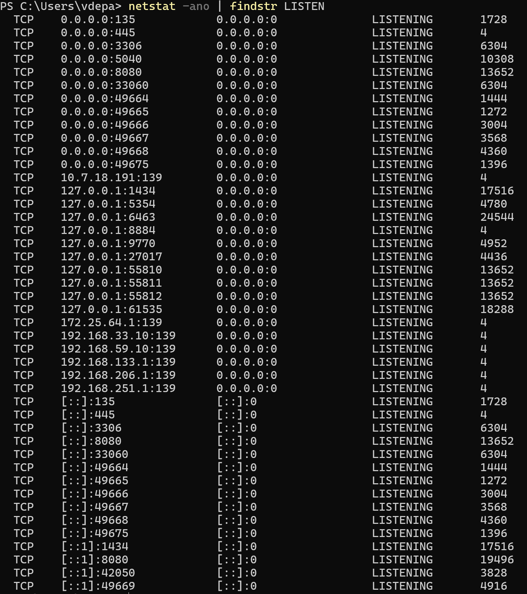
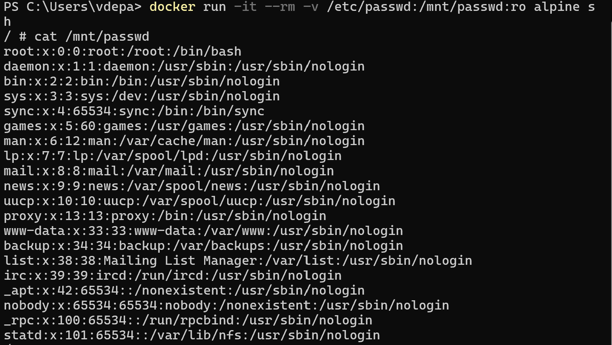
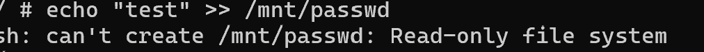
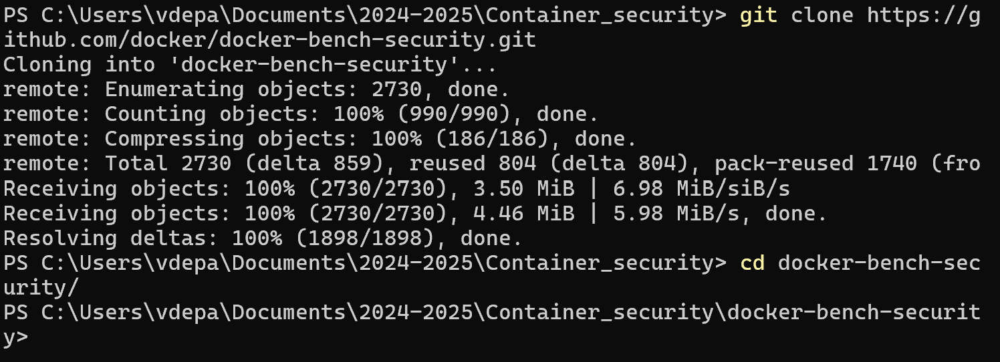
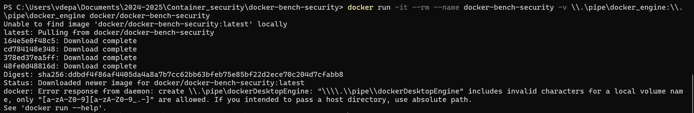

# Session 2

## Gestion des Réseaux et des Secrets

## Sécurisation Réseau

### Éviter l’Exposition Involontaire de Ports

Lancer un container avec restriction de ports  :

Vérifier si le port est exposé avec netstat ou ss.

### Restreindre les permissions d’accès aux fichiers sensibles

Monter un volume avec des permissions spécifiques

Pouvez-vous lire le fichier /mnt/passwd ?

On peut effectivement voir

Pouvez-vous écrire dans /mnt/passwd ?

On ne peut pas écrire dans le passwd

### Auditer la configuration d’un container avec Docker Bench

Installer et exécuter Docker Bench for Security 

