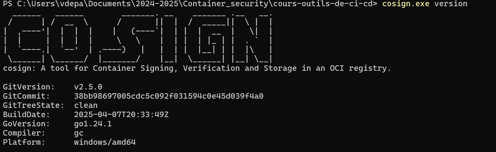
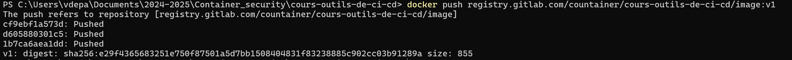
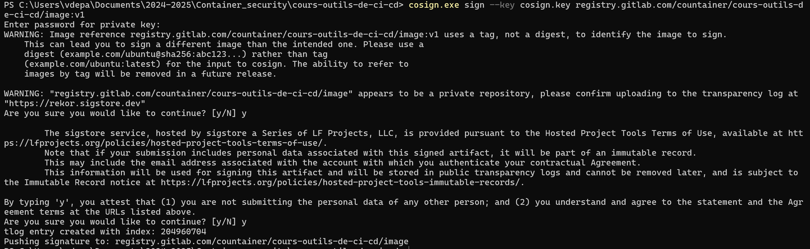
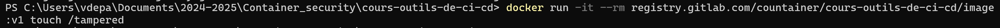
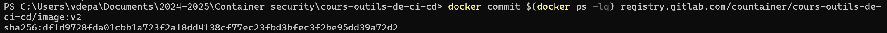
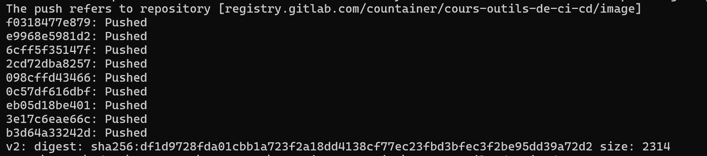
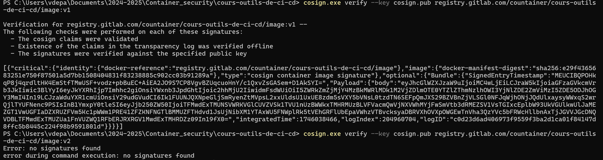
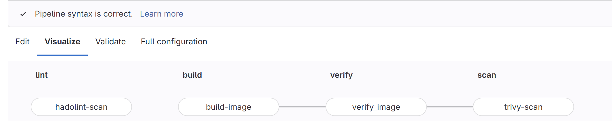
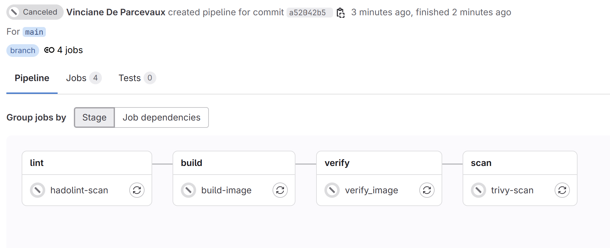
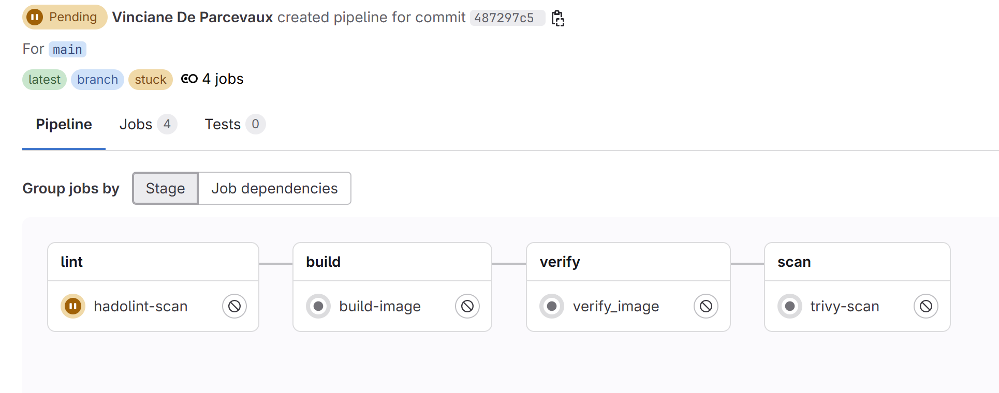

# Session 4 : Sécurité dans la CI/CD

## Signature d'images avec COSIGN
## 1.Générer une paire de clés
Installation de cosign

On a choisi la passphrase : Choisirunepassphrase

Push de l'image

Signature avec Cosign + clé GPG

## 3.Modifier l'image et pousser une version modifiée

Créer une modification (ex: ajouter un fichier vide)

Committer la modification et pousser

## 4. Vérifier la signature avant/après modification

Vérification de l'image originale et altérée

## 5. Quelles sont les résultats de ces 2 commandes ?
Pour l'image:v1
- Signature vérifiée avec succès.
- Cosign a validé les revendications.
- Il a vérifié l'inclusion dans le journal de transparence (hors ligne).
- La signature correspond à la clé publique dans cosign.pub.

Pour l'image:v2
- Aucune signature n'a été trouvée.
- Cela signifie que image:v2 n'a pas été signée avec cosign (ou du moins pas avec la clé que nous avons fourni).

## Sécurité dans les Pipelines CI/CD

- Lint (hadolint-scan) → vérifie la qualité du Dockerfile.

- Build & Sign (build-image) → construit et pousse l'image + signature Cosign.

- Verify (verify_image) → vérifie la signature Cosign.

- Scan (trivy-scan) →  Trivy détecte une vulnérabilité critique dans l'image.

Ici il n'arrive pas à passer le lint (l'étape du Dockerfile)